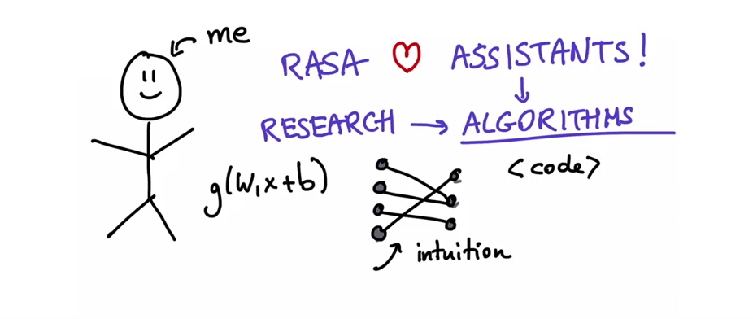

# Algorithm Whiteboard Resources

This is where we share notebooks and projects used in our [youtube channel](https://www.youtube.com/watch?v=wWNMST6t1TA&list=PL75e0qA87dlG-za8eLI6t0_Pbxafk-cxb).

#### Video 1-3: DIET Architecture 

In the final video we make changes to a configuration file. The configuration files, the streamlit application as well as an instructions manual can be found in the `diet` folder.

#### Video 4: Letter Embeddings

The kaggle dataset can be found [here](https://www.kaggle.com/therohk/million-headlines).

We've added the two notebooks in this repo in the `letter-embeddings` folder. But you can also run them yourself in google colab. The notebooks are mostly identical but the `v1` notebook only uses one token to predict the next one while `v2` uses two tokens to predict the next one.

Notebook with one token input:  

Notebook with two token input: 

#### Video X: Conditional Random Fields [video not released yet]

The entire project was too big to add here so we've created a seperate github repo which can be found [here](https://github.com/RasaHQ/crf-demo).

The main file that we've changed, the `config.yml` file, can be found in the `crf` folder of this repo as well. There may be some online material that might help you appreciate some details. 

- The [implementation of CRF in Rasa](https://github.com/RasaHQ/rasa/blob/master/rasa/nlu/extractors/crf_entity_extractor.py#L44) directly in github.
- Extra [maths](https://timvieira.github.io/blog/post/2015/04/29/multiclass-logistic-regression-and-conditional-random-fields-are-the-same-thing/) that details the similarity between CRFs and Logistic Regression
